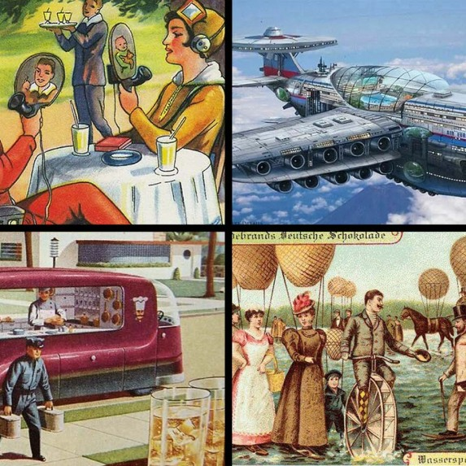

# Pamiętasz latające samochody?

<figure><figcaption>
Przyszłość w wyobrażeniach artystów z lat 60' XX w.
</figcaption></figure>

Kiedy w latach 60' ub. w. rozpoczął się ogromny rozwój technologii użytkowych, równocześnie zaczęły pojawiać się pytania, które słyszymy też dzisiaj - skoro teraz rozwijamy się tak szybko, to pomyślmy co będzie za 10, 20, 50 lat!

I tak ludzie wodzeni własną wyobraźnią wymyślili np. latające samochody, pomidory wielkości człowieka czy zautomatyzowane rolnictwo z pomocą rur i wielkich, plastikowych silosów.

Oczywiście przewidziano też takie rzeczy jak internet, wideorozmowy czy smartfony, jednak nie wyróżniały się one wtedy jako te "najbardziej prawdopodobne" - każde z tych ilustracji było wtedy postrzegane jako równie futurystyczne.

Dzisiaj jesteśmy w podobnej sytuacji, będąc u progu ery AI zaczynamy wyobrażać sobie niesamowitą przyszłość i zastosowania nowych możliwości.

Widzimy świat, w którym wszystko będzie można zrobić pojedynczą wiadomością w chacie z naszym robotycznym asystentem. Widzimy upadające firmy i zwalnianych pracowników, masowo znikające zawody zastępowane przez AI czy nawet koniec ludzkości.

To wszystko to jednak marzenia tworzone przez nasze umysły, które nie potrafią zweryfikować czy coś jest możliwe w rzeczywistości. Poddajemy się więc najłatwiejszej drodze - przyjęcia, że czeka nas wielka rewolucja.

I samo w sobie to nie byłoby złe gdyby nie uderzało w ludzkie emocje. Poczucie zagrożenia, niepewności i FOMO wpływa na to jakie decyzje podejmujemy, na naszą motywację i kreatywność.

Kluczowe jest to by się nie bać przyszłości i ją racjonalnie analizować, a w szczególności nie czytać utopijnych głupot pisanych przez infuencerów żerujących na FOMO wobec AI i na naszych własnych emocjach.

Gdy dzisiaj patrzymy na rysunki z gazetek sprzed 60 lat widzimy je jak coś zabawnego, absurdalnego czy niemożliwego. Dlaczego więc czytając o AI popełniamy ten sam błąd co ludzie wiele dekad temu?
